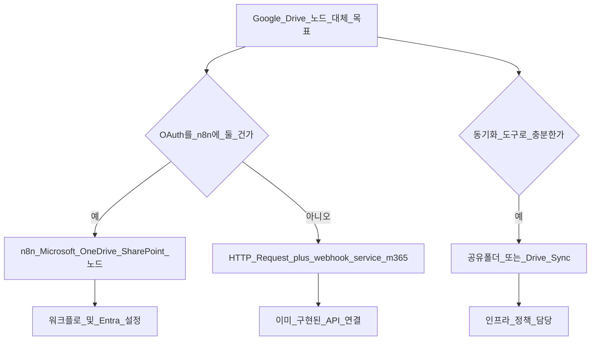

# n8n에서 Google Drive 대신 M365 연동 — 별도 개발 vs 공유 폴더

Google Drive 노드를 Microsoft 365(OneDrive / SharePoint / Teams 파일)로 바꿀 때의 선택지와, 별도 코드 개발이 필요한지 여부를 정리한다.

## 결론 요약

| 접근 | 별도 개발(코드) | 비고 |
|------|----------------|------|
| **n8n 기본 Microsoft 노드** (OneDrive / SharePoint 등) | **거의 없음** — 워크플로·자격 증명·Entra 설정 위주 | Google Drive 노드와 **1:1 치환**은 동작·필드가 완전 같지 않을 수 있음 |
| **HTTP Request → [webhook-service-m365](../webhook-service-m365/)** | **이미 구현됨** — 노드 교체만 | 업로드·고정 사이트(app-only)에 적합; n8n에 Microsoft OAuth를 안 넣어도 됨 |
| **공유 폴더 / 동기화**(OneDrive 동기화·rclone 등) | 인프라·정책 작업; **n8n은 그대로 Google 또는 로컬 경로** | “노드가 M365와 직접 말한다”가 아니라 **간접 복제**; 지연·충돌·감사 추적은 운영 이슈 |

**“M365와 직접 연동”**이 목표면 **공유 폴더만으로 처리**하는 것은 가능하지만, 그건 **동기화 도구에 의존**하는 우회이고, **n8n 노드가 OneDrive/SharePoint API를 쓰는 것과는 다르다.**

---

## 1. n8n 기본 노드만으로 바꾸는 경우 (별도 백엔드 없음)

- n8n에는 **Google Drive**와 별도로 **Microsoft 계열**(버전에 따라 **Microsoft OneDrive**, **Microsoft SharePoint** 등) **내장 노드**가 있다. 공식 문서에서 “Microsoft” / “OneDrive” / “SharePoint” 통합을 확인하면 된다.
- **필요한 것**: Entra 앱 등록, **OAuth2(위임)** 자격 증명을 n8n에 연결, 필요한 Graph 권한·관리자 동의, 워크플로에서 작업 유형(업로드/다운로드/목록)을 Google 노드와 동일하게 맞추기.
- **별도 개발**: 커스텀 노드나 새 서비스 **불필요**. 다만 워크플로 **JSON 수정·테스트**는 필요하고, Google 노드가 쓰던 **표현식·필드명**은 그대로 복붙이 안 될 수 있음.

**한계**: [webhook-service-m365](../webhook-service-m365/)는 **클라이언트 자격 증명(app-only)** 이고, n8n 내장 Microsoft 노드는 보통 **사용자 OAuth(위임)** 쪽에 가깝다. **같은 Entra 앱을 쓰더라도** 플로우(위임 vs app-only)가 다르면 권한·동의 구성도 달라질 수 있다.

---

## 2. HTTP Request + webhook-service-m365 (이 레포 방식)

- [webhook-service-m365/README.md](../webhook-service-m365/README.md) 및 [n8n-cloud-m365/n8n-template/README.md](../n8n-cloud-m365/n8n-template/README.md)대로, **Google Drive 노드 대신** (또는 그 뒤 단계로) **HTTP Request**로 `POST /v1/upload`를 호출하는 방식.
- **별도 개발**: 업로드 API는 **이미 있음**. 응답 상위 필드에 **`webUrl`**, **`id`**, **`name`** 이 포함되며, 기본 임계값 초과 시 Graph **업로드 세션**(분할 업로드)을 사용한다. 다중 사이트·추가 작업은 요구가 늘 때 `webhook-service-m365`를 확장하면 된다.
- **장점**: n8n에 Microsoft OAuth를 넣지 않고 **API 키만**으로 통제 가능; 보안 검토 시 “한 곳에서 Graph”로 설명하기 쉬움.

---

## 3. “공유 폴더” 등으로 처리하는 경우

가능한 패턴 예:

- n8n은 계속 **Google Drive**에 쓰고, **Google Drive ↔ 로컬/SharePoint 동기화** 도구로 M365 쪽 폴더를 채운다.
- 또는 n8n이 **로컬/네트워크 폴더**에 쓰고, **OneDrive 동기화 클라이언트**가 그 폴더를 클라우드에 올린다.

**이때**:

- n8n 입장에서는 **Google Drive 노드 또는 로컬 파일 노드**만 쓰면 되므로 **M365 전용 노드 개발은 불필요**할 수 있음.
- 대신 **실시간성**, **양방향 충돌**, **누가 올린 파일인지(감사)**, **DLP/라벨** 같은 건 **동기화 제품·정책**에 맡기게 됨.
- “Teams 채널 파일 탭에 정확히 이 경로” 같은 요구는 **동기화 경로 매핑**으로 맞춰야 해서 **운영 복잡도**가 올라감.

---

## 4. 권장 선택 가이드

- **최소 코드·중앙 Graph**: **HTTP + webhook-service-m365**가 맞음.
- **Google과 같은 UI로 노드만 갈아끼우기**: **n8n Microsoft 내장 노드** 검토(별도 커스텀 노드 개발은 보통 불필요).
- **IT가 동기화만 허용**: **공유 폴더/동기화**는 가능하나, “M365 API 연동”과는 다른 문제 해결 방식.

---

## 5. 이 레포와의 정합성

- [webhook-service](../webhook-service/)는 Google OAuth·Drive와 결합된 경로가 있고, [webhook-service-m365](../webhook-service-m365/)는 그 **동일 앱을 복제한 뒤** M365 `POST /v1/upload` 등을 **같은 프로세스에 추가**한 변형이다(기본 포트 3001). M365만 쓰려면 경량 배포 대신 이 통합 이미지를 쓸 수 있다.
- “Google Drive 노드를 없애고 M365만”이면 **(2) 또는 (1)** 이고, **(3)은 n8n–M365 직접 연동이 아님**이라 요구사항 문서에 그렇게 적는 것이 좋음.

---

## 6. 중앙 Graph 전용 서버 (권장 아키텍처 메모)

Microsoft Graph 호출을 n8n이 아니라 **[webhook-service-m365](../webhook-service-m365/)** 같은 **별도 HTTP 서비스에서만** 수행하는 방식이다. n8n은 오케스트레이션만 하고, `POST /v1/upload` 등 **좁은 API**와 `x-api-key`로 붙인다.

### 장점

- **비밀·동의 경계**: Entra 클라이언트 시크릿(또는 인증서)과 애플리케이션 권한이 n8n 워크플로·백업에 흩어지지 않고, 서버 환경 변수·시크릿 저장소에만 둘 수 있다.
- **감사·설명**: “M365에 쓰기가 나가는 경로는 이 API뿐”이라고 정리하기 쉽다. Graph 스로틀·재시도·로깅도 한 코드베이스에서 통일할 수 있다.
- **무인 실행과의 궁합**: 배치·웹훅 체인에는 **클라이언트 자격 증명(app-only)** 이 흔하며, 이는 n8n OAuth 노드보다 **백엔드 전용 서비스**에 두는 편이 자연스럽다.
- **n8n 업그레이드와 분리**: n8n 버전이 바뀌어도 M365 연동 정책은 이 서비스만 수정하면 된다.

### 감수할 점

- **기능 확장은 서버 책임**: 응답의 **`webUrl`** 과 기본 임계값 이상 파일의 **업로드 세션**은 `webhook-service-m365`에 반영되어 있다. 여러 사이트·드라이브, 삭제·버전 등 추가 요구는 여전히 **이 서비스의 엔드포인트·로직 확장**으로 간다.
- **추가 홉**: n8n → HTTP → Graph 로 한 단계 더 간다. 대용량·타임아웃·메모리(예: 업로드 버퍼)는 설계 시 검토한다.
- **가용성**: 이 서비스가 내려가면 M365 업로드 경로 전체가 멈출 수 있으므로, 헬스체크·재시작·필요 시 이중화를 운영에서 고려한다.
- **감사 상의 주체**: app-only이면 Graph/감사 로그상 작성 주체가 **앱**에 가깝다. 실제 요청자(사람·워크플로)를 남기려면 API에 메타데이터(예: 요청 ID, 내부 사용자 ID)를 받아 **자체 로그**에 남기는 보완을 검토한다.

### 한 줄 정리

Okta 등으로 **사람 인증**을 하고, Graph는 **서버(app-only)만** 호출하는 다층 모델과 잘 맞으며, 레포의 `webhook-service-m365`가 그 역할의 기본 뼈대다. 요구사항이 늘면 **이 서비스만 확장**하면 된다.

## 관련 문서

- [n8n-webhook-sync.md](./n8n-webhook-sync.md) — 기존 웹훅·동기화 맥락
