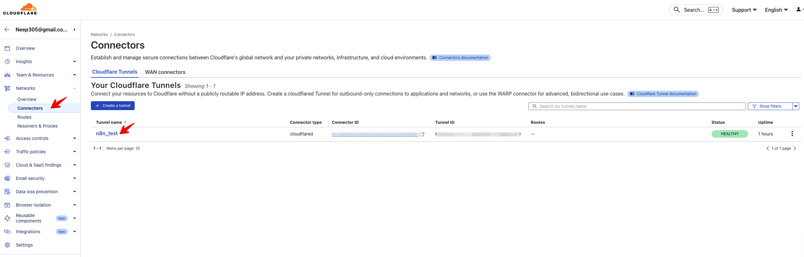
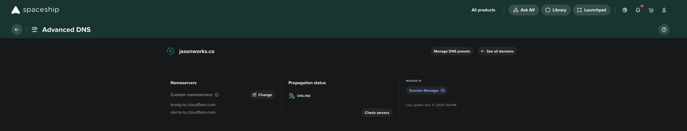

# Setup

## 도메인 준비
### 도메인 없는 경우
- [https://tld-list.com/](https://tld-list.com/) 방문
    - 사용할 도메인 가격 확인
    - 구매: 가장 싼 Spaceship.com에서 구매

### 도메인 있는 경우 
- SKIP

### 도커 설정

## Cloudflare 터널링
### Tunnel 설정


### Spaceship.com DNS 설정
- 아래 도메인을 등록해야 한다.
    - brady.ns.cloudflare.com
    - sierra.ns.cloudflare.com
    


### 로컬 Docker n8n 노출하기
1. [cloudflared](https://developers.cloudflare.com/cloudflare-one/connections/connect-networks/downloads/)를 설치한 뒤 `cloudflared tunnel login`으로 계정을 연결한다.  
2. n8n Docker 컨테이너가 `localhost:5678`에서 정상적으로 뜨는지 확인한다. docker-compose를 쓰는 경우 `ports: - "5678:5678"` 매핑이 필요하다.
3. 새로운 터널을 생성하고 라우팅을 설정한다.
    ```bash
    cloudflared tunnel create n8n-local
    
    # 로컬 n8n(5678)을 외부 도메인에 매핑
    cloudflared tunnel route dns n8n-local n8n.example.com
    ```
4. 아래와 같이 `config.yml`을 작성한다. (위치: `~/.cloudflared/config.yml`)
    ```yaml
    tunnel: n8n-local
    credentials-file: /Users/<USER>/.cloudflared/<UUID>.json
    
    ingress:
      - hostname: n8n.example.com
        service: http://localhost:5678
      - service: http_status:404
    ```
5. 터널을 실행한다.
    ```bash
    cloudflared tunnel run n8n-local
    ```
6. Cloudflare Dashboard > Zero Trust > Access > Tunnels에서 터널 상태가 Healthy인지 확인하고, 방금 설정한 호스트네임(n8n.example.com)의 DNS 레코드가 자동으로 생성되었는지 확인한다.
7. 브라우저에서 `https://n8n.example.com`으로 접속해 n8n UI가 열리는지 테스트한다. Cloudflare Proxy(주황색 구름)가 켜져 있어야 외부 요청이 터널로 전달된다.

> **TIP**  
> 로컬 개발 중 자동으로 터널을 띄우고 싶다면 `cloudflared tunnel run n8n-local --url http://localhost:5678` 명령을 dev 환경 스크립트에 추가하면 된다.
